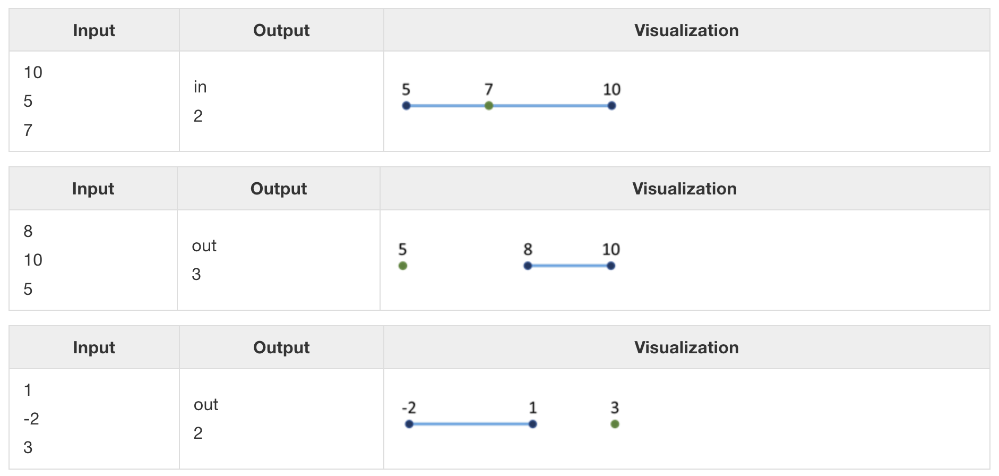
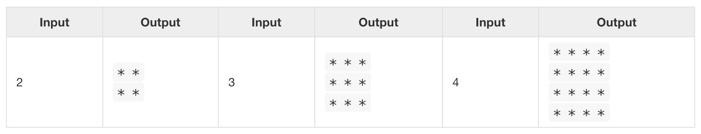

# Git Playground

## Problem 1: Titik pada Segmen

Pada sebuah garis horizontal, terdapat sebuah segmen horizontal yang ditentukan oleh koordinat x di kedua ujungnya: first dan second. Sebuah titik berada pada garis horizontal yang sama dan ditentukan oleh koordinat x-nya. Tulislah sebuah program yang memeriksa apakah titik tersebut berada di dalam atau di luar segmen, serta menghitung jarak dari titik tersebut ke ujung segmen terdekat.

### Data Input
Dari konsol, dibaca 3 bilangan bulat (satu per baris):
- Pada baris pertama terdapat angka pertama – salah satu ujung segmen.
- Pada baris kedua terdapat angka kedua – ujung segmen lainnya.
- Pada baris ketiga terdapat angka point – posisi titik tersebut.

Semua input adalah bilangan bulat dalam rentang [-1000 … 1000].

### Data Output
Cetak hasil pada konsol:
- Pada baris pertama, cetak "in" atau "out" – apakah titik berada di dalam atau di luar segmen.
- Pada baris kedua, cetak jarak dari titik ke ujung segmen terdekat.

### Sample Input and Output

## Problem 2: Square of Stars

Cetak ke konsol sebuah persegi yang terbuat dari N x N tanda bintang (*):

### Data Input
Sebuah input adalah bilangan bulat dalam rentang [1 … 100].

### Sample Input and Output
